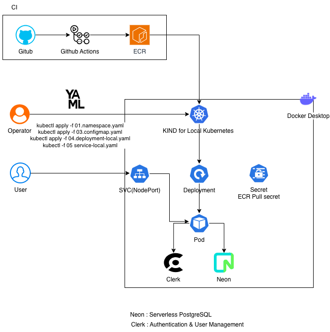

# Phase 2 – CI with GitHub Actions

## 🏗 Architecture Diagram


> This diagram illustrates the CI flow where application code is built by GitHub Actions,
> pushed to Amazon ECR, and deployed manually to a local Kubernetes cluster (KIND).
> External services such as Clerk and Neon are integrated at runtime.

---

## 🎯 Goal
Establish a **reliable Continuous Integration (CI) pipeline** that automates container image
build and publishing, while keeping deployment **explicit and observable**.

This phase intentionally focuses on CI only, not full automation.

---

## 🧩 Scope of This Phase

What this phase **includes**:
- Automated Docker image build
- Image push to Amazon ECR
- Kubernetes pulling images from ECR
- Manual deployment using Kubernetes manifests

What this phase **intentionally excludes**:
- Automated deployment (CD)
- GitOps workflows
- Cluster-level automation

---

## ⚙️ CI Flow Explained

### 1. Code Change
- Application code is pushed to GitHub.

### 2. GitHub Actions
- A GitHub Actions workflow is triggered on push.
- The workflow:
  - Builds a Docker image
  - Tags the image
  - Authenticates with AWS
  - Pushes the image to Amazon ECR

### 3. Container Registry (ECR)
- ECR serves as the centralized image registry.
- Each build produces an immutable image version.

### 4. Kubernetes Deployment (Manual)
- The local Kubernetes cluster (KIND) pulls images from ECR using an image pull secret.
- Deployment is performed manually to keep changes explicit:

```bash
kubectl apply -f 01-namespace.yaml
kubectl apply -f 03-configmap.yaml
kubectl apply -f 04-deployment-local.yaml
kubectl apply -f 05-service-local.yaml
