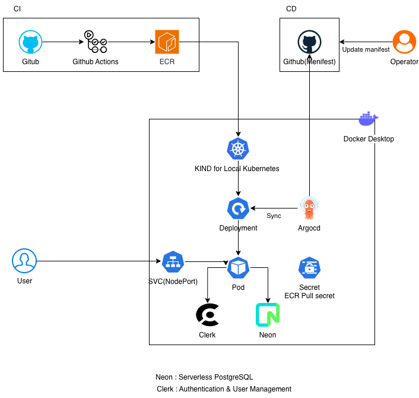
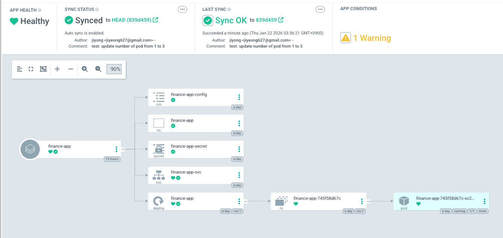
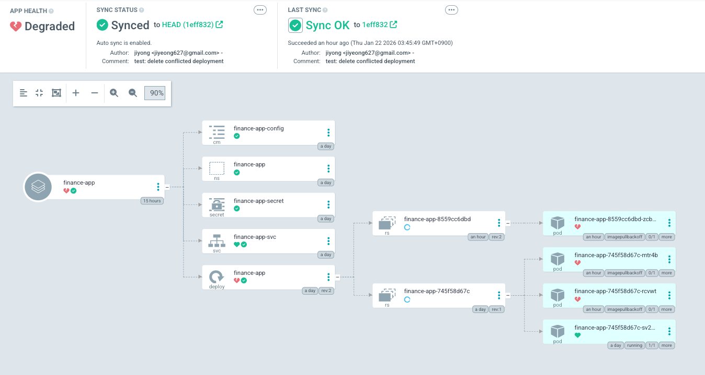
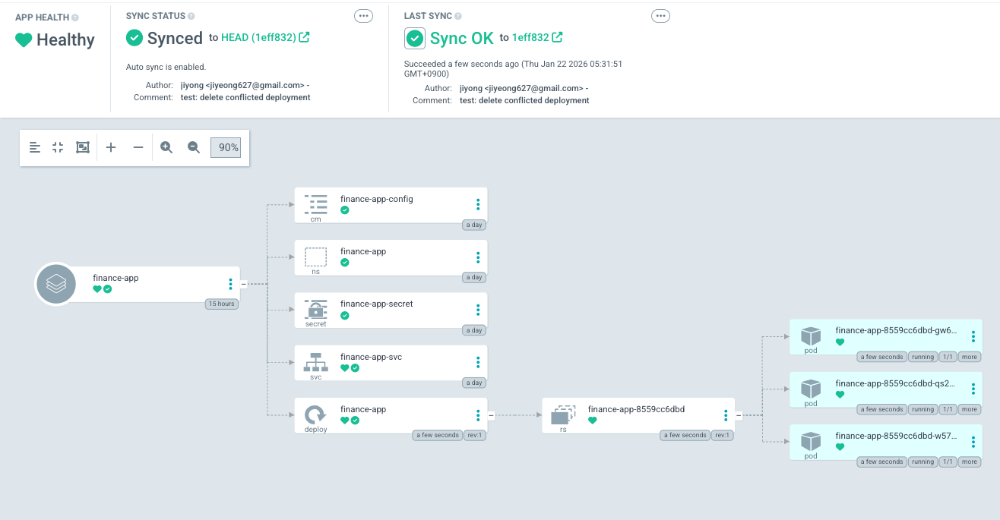
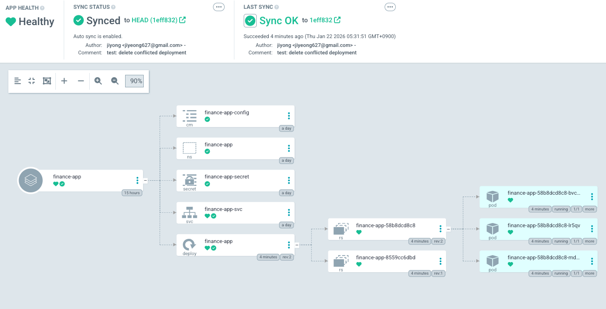

# Phase 3 – GitOps Deployment with Argo CD

## 🧭 Overview

In this phase, I introduced **Argo CD** to transition from manual Kubernetes deployments to a **GitOps-based continuous delivery model**.

The goal was to validate that:
- Kubernetes manifests stored in GitHub act as the **single source of truth**
- Changes made in Git are automatically reconciled into the cluster
- Argo CD accurately tracks rollout state, health, and historical resources

This phase was executed on a **local Kubernetes cluster (Kind)** running on Docker Desktop.

---

## 🏗 Architecture (CI + CD with Argo CD)



**Flow summary:**
- **CI**: GitHub Actions builds and pushes container images to Amazon ECR
- **CD**: Argo CD continuously watches the `finance-app-k8s` GitHub repository
- **Cluster**: Argo CD synchronizes Kubernetes manifests into the Kind cluster
- **Runtime**: Pods pull images from ECR using a Kubernetes imagePullSecret

A key architectural shift introduced in this phase:
- CI and CD are **fully decoupled**
- Deployments are driven **exclusively by Git state**, not imperative commands

---

## 🔁 GitOps Workflow Introduced

1. Operator updates Kubernetes manifests in `finance-app-k8s`
2. Changes are committed and pushed to GitHub
3. Argo CD detects drift between Git and cluster state
4. Argo CD automatically synchronizes the desired state
5. Kubernetes controllers perform the rollout

As a result, normal operations no longer require:
- `kubectl apply`
- Manual cluster reconciliation

---

## 🧪 Experiment: Scaling Deployment via Git

Before scaling, the application was running with a single Pod in the cluster.



To verify GitOps behavior, I modified the Deployment manifest to increase the replica count:

```yaml
spec:
  replicas: 3
```

After committing and pushing the change:
- Argo CD detected the difference
- The Deployment was automatically updated
- Three Pods were created to match the desired state

This confirmed that **Git is the deployment control plane**, not the operator or kubectl.

---

## 🚨 Issue Encountered: ImagePullBackOff

After updating replicas to 3, Argo CD synced the Deployment, but the new Pods failed to start.
The cluster showed `ImagePullBackOff` errors while pulling the image from Amazon ECR.



### Investigation

Using `kubectl describe pod`, the following errors were observed:


```text
FailedToRetrieveImagePullSecret
authorization failed: no basic auth credentials
```

The root cause was an expired Amazon ECR authentication token, which prevented kubelet
from pulling container images.

---

## 🔍 Root Cause Analysis

- Amazon ECR authentication tokens are **short-lived**
- The existing Kubernetes `imagePullSecret` had expired
- Kubelet could no longer authenticate to ECR to pull images

This highlighted an important distinction:

> Logging in to ECR locally does **not** authenticate Kubernetes nodes.

Registry authentication must be handled explicitly at the cluster level.

---

## ⚠️ Misstep: Manually Deleting a ReplicaSet (and Why It Was Wrong)

At first, I assumed the remaining ReplicaSet was an unnecessary leftover and manually deleted it.
This temporarily made the resource tree look cleaner, but it was the wrong approach in a GitOps workflow.



This was a useful lesson:
- Argo CD and Kubernetes controllers are designed to manage these resources automatically
- Manually deleting controller-managed resources can create confusion and drift
- Git should remain the single source of truth, and the system should converge through reconciliation

---

## ✅ Correct Behavior: ReplicaSet History Is Retained for Rollback

After studying how Deployments work, I learned that ReplicaSet retention is expected behavior.
Kubernetes keeps previous ReplicaSets to support **rollback**.

- The **new** ReplicaSet is active and runs the desired number of Pods
- The **old** ReplicaSet remains with `replicas = 0` as rollout history



This clarified that ReplicaSet retention is a **feature**, not a misconfiguration or resource leak.

---

## 🧠 Key Learnings from Phase 3

- GitOps enforces **declarative control**, even when runtime fixes are required
- Argo CD tracks **historical rollout state**, not just current replicas
- Container registry authentication is a **cluster-level responsibility**
- Manually deleting managed resources breaks GitOps assumptions
- ReplicaSets are intentionally preserved to enable safe rollback

