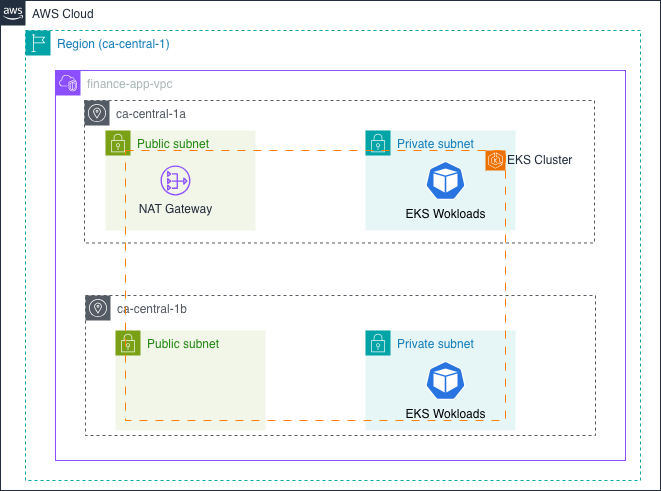
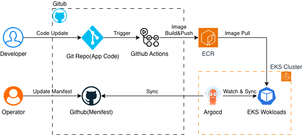
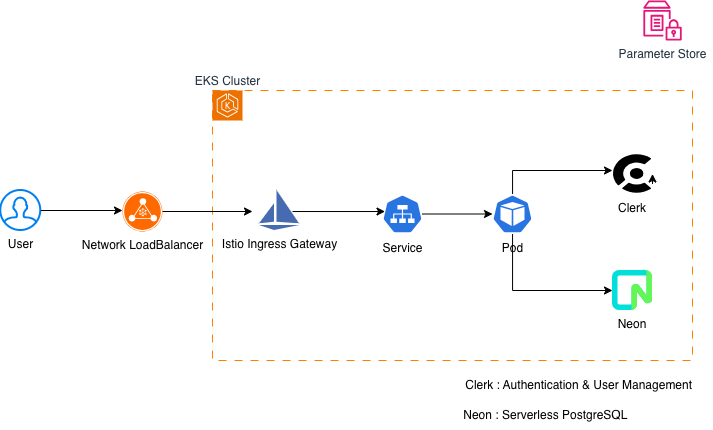

## 🧭 Overview

In this phase, I expanded the Kubernetes platform from a **local Kubernetes cluster (Kind)**
to a **cloud-managed Kubernetes environment on AWS EKS**.

The goal was to validate that:
- GitOps workflows established in previous phases continue to function on EKS
- Git remains the **single source of truth** for deployments
- Platform-level decisions introduce realistic networking, security, and cost trade-offs

This phase was executed using **On-Demand EKS node groups** to prioritize fast and
predictable validation over cost optimization during early testing.

## 🏗 Infrastructure Architecture (VPC / Subnet / EKS)

The EKS cluster is deployed inside a custom VPC spanning two Availability Zones.

- Public subnets:
  - NAT Gateway
- Private subnets:
  - EKS worker nodes only

**Cluster endpoint access:**
- Public: enabled
- Private: enabled

Worker nodes are placed exclusively in private subnets to enforce
production-like network isolation and security boundaries.

## 🔄 CI/CD Pipeline (GitOps Model)

**Pipeline summary:**
- GitHub Actions builds and pushes container images to Amazon ECR
- Kubernetes manifests are managed in `finance-app-k8s`
- Argo CD continuously watches the `env/eks` branch
- Desired state is reconciled into the EKS cluster

The CI/CD separation introduced in Phase 3 remains unchanged.
Only the runtime target has moved from local Kind to AWS EKS.

## 🔁 GitOps Workflow Introduced

1. Operator updates Kubernetes manifests in `finance-app-k8s`
2. Changes are committed to the `env/eks` branch
3. Argo CD detects drift between Git and EKS cluster state
4. Argo CD synchronizes the desired state
5. Kubernetes controllers perform the rollout

The Git branch now represents the environment,
allowing local and EKS clusters to evolve independently.

## 🌐 Runtime Traffic Flow (Istio Ingress)

Runtime traffic flows through the following layers:

- Network Load Balancer (AWS)
- Istio Ingress Gateway
- Kubernetes Service
- Application Pod

Although the application currently consists of a single service,
Istio was introduced early to prepare the platform for
future service expansion and advanced traffic control.

## 🔐 Secrets Management (Cost-Driven Decision)

Secrets were externalized from Kubernetes and managed using AWS-native services.

### Design Choice

AWS Systems Manager **Parameter Store** was used instead of AWS Secrets Manager
**explicitly due to cost considerations**.

- Secrets Manager incurs a recurring per-secret cost
- Parameter Store (Standard tier) is significantly cheaper
- Advanced features such as automatic rotation were not required for this phase

While Secrets Manager is generally preferred for production workloads,
Parameter Store provides a cost-effective alternative suitable for
learning and early-stage platform validation.

## ⚙️ Node Group Strategy (Speed over Cost)

The EKS cluster uses **On-Demand managed node groups**.

- Desired: 2
- Minimum: 2
- Maximum: 3
- Subnet placement: Private subnets only

Although Spot Instances could reduce costs,
On-Demand nodes were intentionally chosen to:

- Avoid interruption noise
- Enable faster testing cycles
- Keep platform behavior predictable

## 💸 Cost Awareness & Cleanup

AWS resources introduced in this phase:
- NAT Gateway
- EKS Cluster
- Managed Node Groups

After validation:
- All unnecessary resources were explicitly deleted
- No idle infrastructure was left running

Cost control was treated as a core operational responsibility.

## 🧠 Key Learnings from Phase 4

- Infrastructure, delivery, and runtime concerns must be explained separately
- GitOps workflows scale cleanly from local clusters to EKS
- Cost-aware design decisions shape early platform architecture
- Istio clarifies future routing and observability paths

