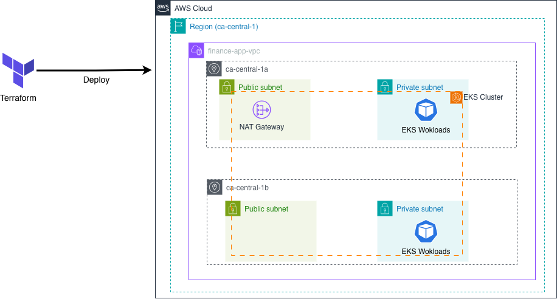

## Overview

In this phase, I transitioned AWS infrastructure provisioning from manual, console-based operations to a fully Terraform-managed Infrastructure as Code workflow.

The goal was not simply to “use Terraform,” but to establish a reproducible, auditable, and operationally safe infrastructure baseline that can support long-term evolution of the Kubernetes platform.

Since Kubernetes workloads were already verified as stable in the previous phase, this phase intentionally focused only on the infrastructure layer, without modifying application-level components.

## Why This Phase Exists

Until Phase 04, the EKS cluster and surrounding AWS resources were created manually through the AWS Console.  
While useful during the learning phase, this approach introduced clear limitations:

- No single source of truth for infrastructure state
- High risk of configuration drift caused by manual changes
- Difficult environment recovery and replication
- Poor scalability as the platform grows

Once the Kubernetes layer became stable, it became clear that infrastructure had to be fixed in code; otherwise, every subsequent phase would rest on an unstable foundation.  
This phase addresses that gap by introducing Terraform as the authoritative infrastructure layer.

## Architecture Overview

The diagram above represents the AWS infrastructure after migrating from manual console-based provisioning to a Terraform-managed model.

All resources are deployed in a single region (`ca-central-1`) using a multi-AZ VPC layout.  
Public subnets host NAT Gateways, while all EKS workloads run in private subnets.  
Terraform acts as the single deployment interface, defining and maintaining the entire infrastructure state.

## Repository & Environment Layout

The Terraform repository is structured to reflect deployment order, change frequency, and resource lifecycle boundaries.

'''
finance-app-terraform/
└── envs/
    └── prod/
        ├── bootstrap/
        ├── network/
        ├── eks/
        ├── addons/
        │   └── alb-controller/
        └── istio/
'''

This structure is intentional: the directory layout itself encodes operational knowledge and dependency boundaries, rather than hiding them inside a single monolithic Terraform project.

## Bootstrap – Terraform State Infrastructure

The `bootstrap` directory contains infrastructure required **by Terraform itself**, not by the application platform.

### Managed Resources
- S3 bucket for Terraform state storage
- DynamoDB table for state locking

### Design Decisions
- Applied only once during initial setup
- Never destroyed after creation
- DynamoDB configured with **Pay-Per-Request** billing mode to minimize cost

By separating state infrastructure from application infrastructure:
- Terraform state is protected from accidental deletion
- Infrastructure management becomes safer and more predictable
- Long-term operation is supported without manual recovery steps

The `bootstrap` layer is treated as a foundational control plane, not part of the workload infrastructure.

## Layered Deployment Strategy

Infrastructure is applied in clearly defined layers to prevent dependency conflicts.

### Apply Order
1. network
2. eks
3. addons
4. istio

### Destroy Order
1. istio
2. addons
3. eks
4. network

This ordering aligns with actual dependency direction:
- EKS requires networking
- Addons require a running cluster
- Istio depends on both the cluster and core addons

This approach minimizes blast radius, simplifies troubleshooting, and allows selective iteration on specific layers without impacting the entire platform.

## Why Not a Single Terraform Project?

A single large Terraform project was intentionally avoided for the following reasons:

### Change Frequency Isolation
- network: rarely changes
- eks: occasional changes (version, node groups)
- addons: changes relatively often
- istio: frequent experimentation and tuning

Separating layers allows faster iteration where change is expected.

### Failure Containment
- Addon failures do not impact core networking
- Istio experimentation does not destabilize the cluster itself

### Operational Clarity
Directory boundaries make it immediately clear whether an issue is related to:
- networking
- cluster provisioning
- platform addons
- service mesh configuration

## Dependency Safety with depends_on

Explicit `depends_on` relationships are used between modules to prevent Terraform from executing resources in an unsafe or ambiguous order.

This provides an additional safety layer beyond directory separation:
- Prevents unintended parallel execution
- Reduces non-deterministic apply failures
- Protects infrastructure state during both apply and destroy operations

The combination of directory layering and explicit dependencies significantly improves infrastructure predictability.

## Problems Faced – IRSA and OIDC Trust Policy

After Terraform successfully provisioned all AWS resources, Kubernetes workloads failed to start.

### Symptoms
- Pods remained in Pending state
- ExternalSecret and ClusterSecretStore failed to authenticate

### Root Cause
The IAM Role trust policy still referenced the **OIDC provider from the previous EKS cluster**.  
Because the cluster was recreated via Terraform, the OIDC issuer URL had changed.

### Resolution
- Updated IAM Role trust policy to reference the new EKS OIDC provider
- Re-applied Kubernetes manifests
- Verified successful pod startup

This issue highlighted that even when infrastructure provisioning succeeds, identity and authentication layers must be revalidated explicitly.

## Trade-offs and Limitations

### Benefits
- Consistent and repeatable infrastructure provisioning
- Infrastructure state defined and reviewed as code
- Recovery from accidental console changes is straightforward

### Limitations
- Resource destruction still requires human confirmation
- Module-level dependencies impose strict destroy ordering
- Terraform alone does not fully automate operational workflows

Terraform significantly improves safety and reproducibility, but operational efficiency requires additional orchestration on top of it.

## What I’d Do Differently

Future improvements include:

1. Automating OIDC trust policy updates during EKS creation
2. Introducing scripted lifecycle workflows:
   - Ordered destroy execution
   - Auto-approve for controlled environments

Terraform solves provisioning well, but long-term operations benefit from higher-level automation around it.

## Repository

Infrastructure code for this phase is available here:

https://github.com/nemoluv27/finance-app-terraform

This repository now serves as the single source of truth for AWS infrastructure.
