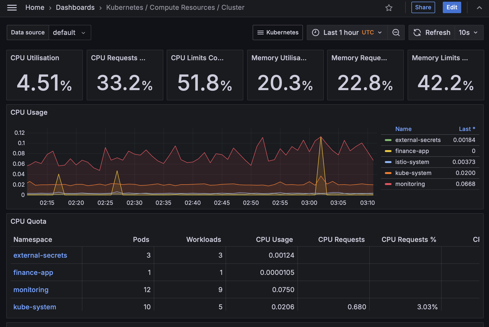
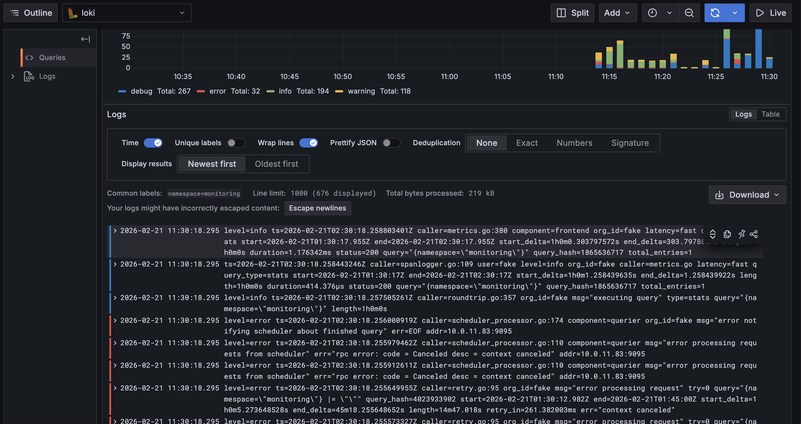
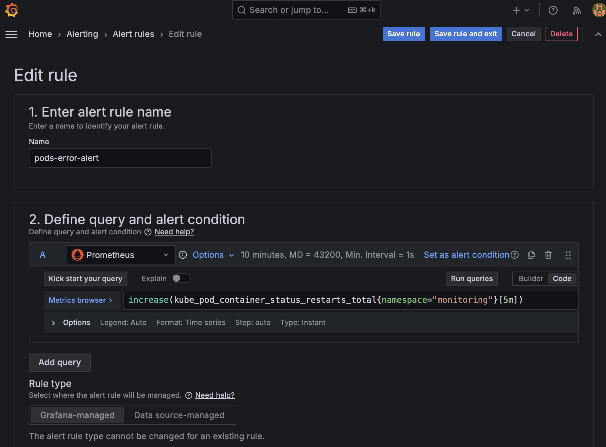
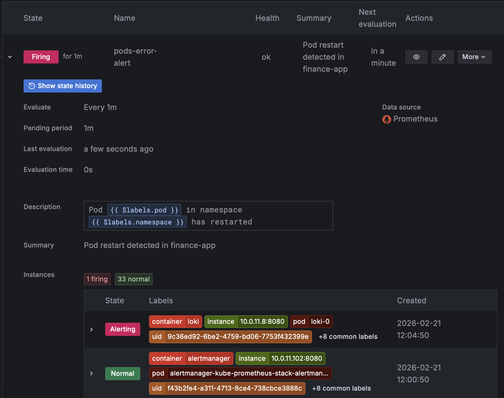
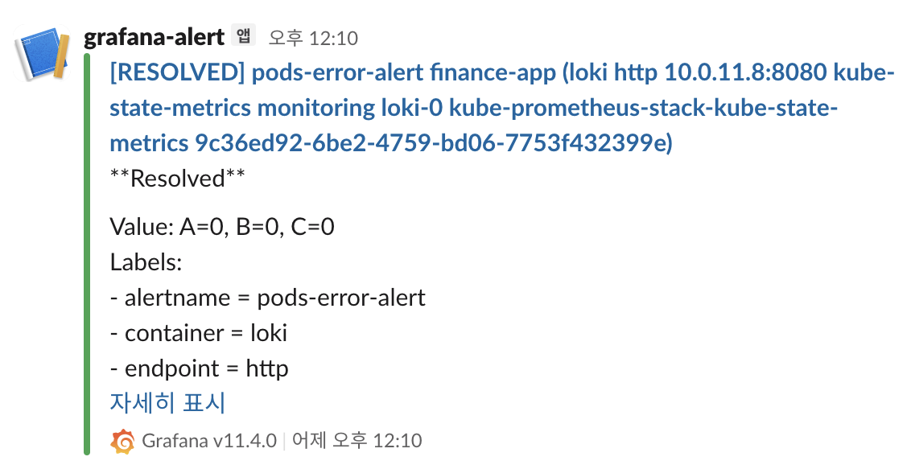

# 📊 Phase 8 — Observability Stack (Prometheus + Grafana + Loki)

📅 Jan 2026 – Present  
🔁 Status: Completed (Metrics & Logs Integrated)

---

## 🧭 Overview

In this phase, I implemented a full observability stack on AWS EKS using Terraform.

Both monitoring and logging were implemented together to build a production-like visibility layer. The objective was not simply to install tools, but to integrate metrics, logs, durable storage, and alerting into the platform lifecycle.

Observability is now provisioned automatically during EKS creation and treated as part of the platform baseline.

---

## ❓ Why This Phase Exists

After infrastructure lifecycle automation (Phase 7), the remaining operational gap was visibility:

- No centralized metrics monitoring
- No structured log aggregation
- No alert pipeline validation
- No long-term durable storage

Without observability, infrastructure automation alone is insufficient for production environments.

This phase closes that gap.

---

## 🏗 What Was Built

### 1️⃣ Terraform-Based Installation

Monitoring components are installed automatically when EKS is provisioned.

Terraform provisions:

- `kube-prometheus-stack` (Prometheus + Grafana)
- Loki
- Dedicated S3 buckets for:
  - Prometheus long-term storage
  - Loki object storage
- IAM roles for S3 access
- Grafana admin password stored in AWS SSM Parameter Store
- PVC for short-term storage

Observability is now part of the infrastructure bootstrap.

---

### 2️⃣ Prometheus — Metrics Collection

Installed via Helm (`kube-prometheus-stack`).

Collects:

- Node CPU / Memory usage
- Pod resource consumption
- Namespace-level metrics
- Kubernetes API metrics
- Pod lifecycle events

---

### 3️⃣ Loki — Log Aggregation

Installed via Helm with:

- PVC for local buffering
- S3 backend for durable storage

Collects:

- Pod stdout/stderr
- Container logs
- Kubernetes events

Logs remain queryable even after pod deletion.

---

### 4️⃣ Grafana — Unified Visibility Layer

Grafana connects to:

- Prometheus (metrics datasource)
- Loki (log datasource)
- Slack (alert contact point)

All integrations were validated manually after installation.

---

# 📊 Dashboards

## 1️⃣ Grafana — Prometheus Cluster Dashboard



Displays:

- Node resource usage
- Pod CPU / Memory
- Namespace breakdown
- Restart counts
- Cluster health overview

---

## 2️⃣ Grafana — Loki Log Dashboard



Capabilities:

- Log filtering by namespace
- Pod-based querying
- Real-time log streaming
- Historical log retrieval from S3

---

# 🚨 Alerting Pipeline

Alerting is configured directly in Grafana.

---

## 3️⃣ Alert Rule Configuration



Alert condition:

Trigger when a new Pod is created or restarted.

This validates pod lifecycle observability.

---

## 4️⃣ Alert Firing (Pod Restart)



When a pod is recreated or restarted:

- Alert state transitions to `Firing`
- Condition is evaluated via Prometheus metrics

---

## 5️⃣ Slack Notification



Information delivered to Slack:

- Alert state (Firing / Resolved)
- Alert name (e.g. `pods-error-alert`)
- Target namespace (e.g. `monitoring`)
- Container name (e.g. `loki`)
- Endpoint information (e.g. `http`)
- Metric values (Value: A, B, C)
- Alert labels
- Timestamp
- Grafana version

Example message:

[RESOLVED] pods-error-alert finance-app  
Value: A=0, B=0, C=0  
Labels:  
- alertname = pods-error-alert  
- container = loki  
- endpoint = http  

End-to-end validation:

Pod restart → Prometheus metric update → Grafana alert evaluation → Slack webhook delivery

---

## Alert Rule Definition

The alert rule is based on Kubernetes pod restart metrics.

PromQL expression:

```promql
increase(kube_pod_container_status_restarts_total{namespace="monitoring"}[5m])
```

---

# 🔐 Security & Configuration Design

- Grafana admin password stored in AWS SSM Parameter Store
- No hardcoded credentials in Terraform
- IAM roles for Loki & Prometheus S3 access
- Namespace isolation for monitoring stack
- S3 backend ensures durability across pod recreation

---

# ⚖️ Architectural Decisions

### Why kube-prometheus-stack?

Pros:
- Production-ready configuration
- Integrated Alertmanager + Grafana
- CRD-based monitoring resources

Cons:
- Larger footprint
- More components than minimal setup

---

### Why S3 Backend?

Pros:
- Durable storage
- Survives pod recreation
- Scalable long-term retention

Cons:
- Additional IAM configuration required
- Slight operational complexity increase

---

# 🎯 What This Phase Demonstrates

✔ Infrastructure-driven monitoring deployment  
✔ Metrics and logs unified in one interface  
✔ Alert pipeline validated end-to-end  
✔ Durable observability storage  
✔ Production-like operational visibility  

The platform is now not only deployable — but observable and operationally accountable.

---


